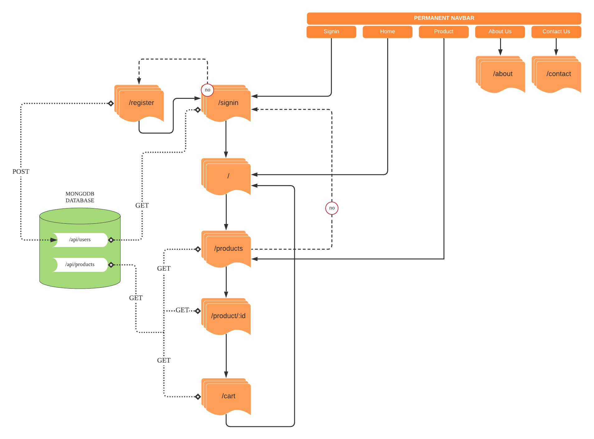
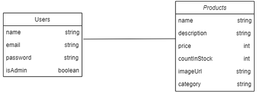

# AI Store E-Commerce Website
AI Store is a one-stop centre e-commerce platform for past, future & upcoming tech products from smallest gadgets to the biggest machinery all around the world. We want to make this platform a daily open diary for shoppers and sellers to exchange their best experiences and quality of gadgets, computers, and machinery. Come and join us having fun with this project !
___
## Reference Diagram
### User Flow Chart
By the time (25/11/2021) this read.me is created, this is the current user flow chart that we have created. Feel free to contribute any additional features.



### Database Schema
Current available database.


___

## Run Locally

### 1. Clone Repo
```  
$ git clone https://github.com/azmir00/AIstore.git
$ cd AIstore
```

### 2. Install Dependencies (root folder)
```  
npm i nodemon
npm i concurrently
npm i bcryptjs
npm i dotenv
npm i express
npm i express-async-handler
npm i jsonwebtoken
npm i mongoose
```

### 3. Install Dependencies (frontend folder)
```  
npm i axios
npm i bootstrap@4
npm i --save redux
npm i redux-thunk
npm i redux-devtools-extension
npm i react-bootstrap@2
npm i react-router-dom@5
```

### 4. Run Both Frontend & Backend
```  
npm run concurrently
```

### 5. Run Frontend Only
```  
npm run client
```

### 6. Run Backend Only
```  
npm run server
```

### 7. Setup MongoDB
* Local Mongodb
  * Install it from [here](https://www.mongodb.com/try/download/community)
  * Create .env file in root holder
  * Set MONGODB_URL=mongodb://localhost/aistore
* Atlas Cloud MongoDB
  * Create database at [https://account.mongodb.com/account/login](https://account.mongodb.com/account/login)
  * Create .env file in root holder
  * Set MONGODB_URL=mongodb+srv://your-db-connection
___


## Inquiries
* Azmir : xzmyr00@gmail.com
* Irfan : irfanzain.tech@gmail.com
___


_Credit : _This is a student project that was created at [BAC education] under a PENJANA KPT-CAP Program._
